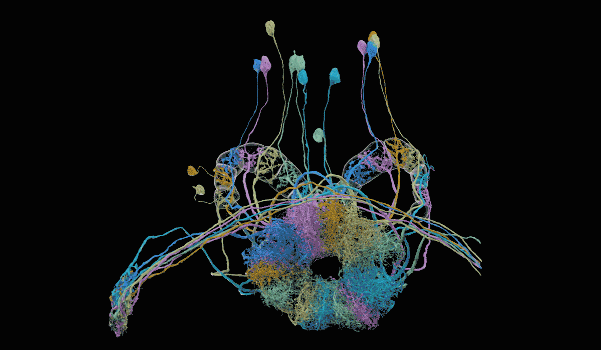
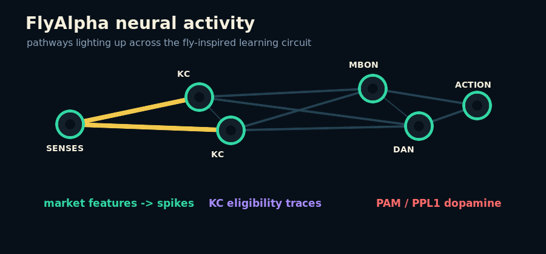
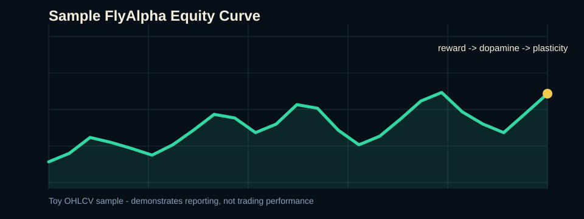
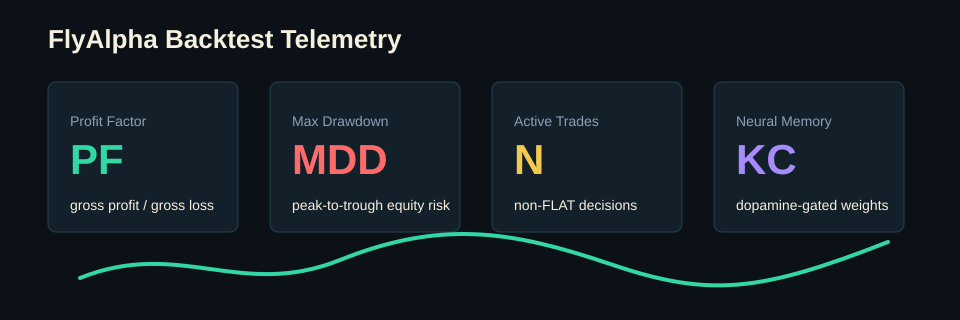

# FlyAlpha

[](https://www.python.org/)
[](LICENSE)
[](#roadmap)



FlyAlpha is an open-source research scaffold for a financial-learning agent
whose learning and decision loop is constrained by fruit-fly nervous-system
ideas rather than conventional machine-learning predictors.

The core rule is simple:

> No transformer, no policy network, no boosted-tree predictor, no
> backpropagation decision model. Market inputs are deterministic; neural
> decisions come from fly-inspired spiking dynamics; learning is localized to a
> mushroom-body-inspired dopamine plasticity layer.

## Contents

- [Why This Exists](#why-this-exists)
- [Visual Overview](#visual-overview)
- [Fly Brain Activities](#fly-brain-activities-we-use)
- [Quick Start](#quick-start)
- [CSV Backtesting](#csv-backtesting)
- [Tuning](#tuning)
- [Ablations And Credit Assignment](#ablations-and-credit-assignment)
- [Exchange Connectivity](#exchange-connectivity)
- [Scientific Controls](#scientific-controls)
- [Sources](#sources)

```text
        MARKET CANDLES
  OHLCV / return / range / volume
               |
               v
   deterministic sensory encoding
               |
               v
   sensory spikes into fly channels
               |
               v
+-----------------------------------+
|        FLY-INSPIRED CNS           |
|                                   |
|  LIF neurons -> synaptic graph    |
|          |                        |
|          v                        |
|  sparse Kenyon-cell activity      |
|          |                        |
|          v                        |
|  KC -> MBON dopamine plasticity   |
|          |                        |
|          v                        |
|  approach / avoidance / hold      |
+-----------------------------------+
               |
               v
        LONG / SHORT / FLAT
               |
               v
     reward prediction error
               |
               v
        PAM / PPL1 dopamine
```

## Why This Exists

MaleCNS v1.0 is a public adult male *Drosophila melanogaster* central nervous
system connectome covering the brain, optic lobes, and ventral nerve cord. The
project page lists the v1.0 release on 2026-06-08, the paper publication on
2026-09-03, and describes the dataset as licensed under CC-BY.

FlyAlpha asks a narrow, testable question:

Can a fly-inspired circuit adapt through dopamine-gated mushroom-body plasticity
in a market-like environment before we ever ask whether it can trade well?

## Visual Overview



```text
market sensory spikes -> fly-inspired CNS -> Kenyon cells
      -> MBON action populations -> PAM/PPL1 dopamine -> KC-to-MBON learning
```





The GIF and graph panels are presentation visuals for the repository. The
Janelia image is attributed in [Sources](#sources); the generated FlyAlpha
assets are not biological reconstructions.

## Fly Brain Activities We Use

| Fly activity | FlyAlpha role |
| --- | --- |
| Sensory transduction | Converts deterministic market features into spike channels |
| Synaptic propagation | Runs activity through an executable directed neural graph |
| Kenyon-cell sparsity | Compresses active sensory patterns into sparse memory traces |
| MBON output | Produces approach, avoidance, and hold population activity |
| PAM-like dopamine | Reinforces eligible synapses after better-than-expected outcomes |
| PPL1-like dopamine | Penalizes eligible synapses after worse-than-expected outcomes |
| Eligibility traces | Keeps recently active KC-to-MBON synapses available for delayed reinforcement |
| Three-factor plasticity | Updates weights from activity, eligibility, and dopamine together |

The LONG / SHORT / FLAT interface is an engineering bridge, not a biological
claim about native fly behavior.

## Repository Map

```text
flyalpha/
  connectome/       MaleCNS provenance and graph records
  brain/            leaky integrate-and-fire neuron simulation
  mushroom_body/    Kenyon activity, MBON readout, PAM/PPL1 dopamine, plasticity
  senses/           deterministic market feature and spike encoders
  actions/          output-population to trading-action mapping
  environment/      execution and reward helpers
  experiments/      toy conditioning experiment
  visualization/    dependency-free learning traces
docs/               biology, assumptions, and architecture notes
tests/              smoke tests for the learning loop
data/sample/        small OHLCV dataset for README demos and local checks
```

## Quick Start

Run the smoke tests:

```bash
python -m pytest -q
```

Use the centralized runner for local stats:

```bash
python -m flyalpha.runner stats --episodes 12
```

Tune the current mushroom-body plasticity parameters:

```bash
python -m flyalpha.runner tune --episodes 24 --limit 10
```

Run the committed sample dataset:

```bash
python -m flyalpha.runner stats --csv data/sample/flyalpha_sample_ohlcv.csv
```

The sample should produce a compact report including final equity, PF, MDD,
active trades, learned weights, and an ASCII reward trace. It is synthetic demo
data, not evidence of market edge.

## CSV Backtesting

Run stats on an existing OHLCV CSV:

```bash
python -m flyalpha.runner stats --csv path/to/candles.csv
```

By default, CSV stats use conservative money management:

```text
initial equity         10000
risk per trade         1%
stop loss              1%
take profit            2%
max position fraction  100%
max leverage           1x
transaction cost       1 bp
```

Override those controls:

```bash
python -m flyalpha.runner stats \
  --csv path/to/candles.csv \
  --initial-equity 10000 \
  --risk-per-trade 0.005 \
  --stop-loss-pct 0.005 \
  --take-profit-pct 0.01 \
  --max-position-fraction 0.5 \
  --max-leverage 1 \
  --cost-bps 2
```

CSV files need these columns:

```text
open,high,low,close,volume
```

Column names are case-insensitive, and extra columns such as `timestamp` or
`symbol` are ignored.

## Tuning

Tune against an existing CSV:

```bash
python -m flyalpha.runner tune \
  --csv path/to/candles.csv \
  --learning-rates 0.01,0.05,0.1,0.2 \
  --trace-decays 0.4,0.6,0.8 \
  --risk-per-trades 0.005,0.01,0.02 \
  --stop-loss-pcts 0.005,0.01,0.02 \
  --take-profit-pcts 0.01,0.02,0.04 \
  --limit 10
```

Tune the sample dataset:

```bash
python -m flyalpha.runner tune \
  --csv data/sample/flyalpha_sample_ohlcv.csv \
  --learning-rates 0.02,0.05 \
  --trace-decays 0.6,0.8 \
  --risk-per-trades 0.005,0.01 \
  --stop-loss-pcts 0.01,0.02 \
  --take-profit-pcts 0.01,0.02 \
  --objective profit_factor \
  --min-trades 3 \
  --limit 5
```

Tuning is ranked by a risk-adjusted score by default:

```text
score = cumulative reward - drawdown_penalty * max drawdown
```

Use `--objective profit_factor` to rank trials by PF instead. The report also
shows profit factor and max drawdown for each trial.

Tuning and validation display a `tqdm` progress bar by default. Add
`--no-progress` when writing logs or running in CI.

<details>
<summary>PF-focused tuning with trade filters</summary>

```bash
python -m flyalpha.runner tune \
  --csv path/to/candles.csv \
  --csv-limit 10000 \
  --learning-rates 0.02,0.05,0.1 \
  --trace-decays 0.6,0.8 \
  --risk-per-trades 0.001,0.0025,0.005 \
  --stop-loss-pcts 0.01,0.02 \
  --take-profit-pcts 0.01,0.02,0.04 \
  --confidence-thresholds 0,0.01,0.05 \
  --min-volatilities 0,0.001 \
  --trend-lookbacks 1,12 \
  --trend-alignments false,true \
  --breakeven-trigger-pcts none,0.005 \
  --trailing-stop-pcts none,0.01 \
  --objective profit_factor \
  --min-trades 20 \
  --limit 15
```

</details>

Run a train/test validation pass:

```bash
python -m flyalpha.runner validate \
  --csv path/to/candles.csv \
  --train-fraction 0.7 \
  --learning-rates 0.05,0.1 \
  --trace-decays 0.4,0.8 \
  --risk-per-trades 0.005,0.01 \
  --stop-loss-pcts 0.005,0.01 \
  --take-profit-pcts 0.01,0.02
```

Run walk-forward validation and save a report:

```bash
python -m flyalpha.runner walk-forward \
  --csv path/to/candles.csv \
  --train-size 35000 \
  --test-size 15000 \
  --step-size 15000 \
  --learning-rates 0.02,0.05,0.1 \
  --trace-decays 0.6,0.8 \
  --risk-per-trades 0.001,0.0025,0.005 \
  --stop-loss-pcts 0.01,0.02 \
  --take-profit-pcts 0.01,0.02,0.04 \
  --trend-lookback 12 \
  --require-trend-alignment \
  --objective profit_factor \
  --min-trades 20
```

Reports are written under `runs/` and include CSV/JSON summaries.

## Ablations And Credit Assignment

Run the core learning-control ablations:

```bash
python -m flyalpha.runner ablate \
  --csv path/to/candles.csv \
  --csv-limit 50000 \
  --controls full,dopamine_disabled,plasticity_frozen,random_reward,reward_delay_12,degree_preserving_random \
  --learning-rate 0.05 \
  --trace-decay 0.8 \
  --risk-per-trade 0.001 \
  --stop-loss-pct 0.01 \
  --take-profit-pct 0.04 \
  --trend-lookback 12 \
  --require-trend-alignment
```

Run credit-assignment delay experiments:

```bash
python -m flyalpha.runner credit \
  --csv path/to/candles.csv \
  --csv-limit 50000 \
  --reward-delays 0,1,3,6,12 \
  --trace-decays 0.4,0.6,0.8,0.95 \
  --learning-rate 0.05 \
  --risk-per-trade 0.001 \
  --stop-loss-pct 0.01 \
  --take-profit-pct 0.04 \
  --trend-lookback 12 \
  --require-trend-alignment
```

`degree_preserving_random` is scaffolded as a connectome-graph rewiring utility
that preserves in-degree, out-degree, sparsity, and synaptic weights. It becomes
an executable ablation once a real MaleCNS graph loader is connected to the
simulation path.

Run one safe paper-trading tick:

```bash
python -m flyalpha.runner trade --mode paper --symbol BTCUSD --action LONG --quantity 0.1
```

If installed as a package, the same commands are available through:

```bash
flyalpha stats --episodes 12
flyalpha tune --episodes 24
flyalpha trade --mode paper --symbol BTCUSD --action LONG --quantity 0.1
```

## Exchange Connectivity

FlyAlpha separates the fly-learning core from exchange APIs:

```text
flyalpha.runner
    |
    v
trading_loop.py
    |
    v
ExchangeClient protocol
    |
    +-- PaperExchangeClient   local simulated fills
    |
    +-- RestExchangeClient    generic REST scaffold for crypto/forex APIs
```

Live trading is intentionally gated. A live order requires:

- an exchange-specific REST base URL;
- API credentials in environment variables;
- the explicit `--i-understand-live-risk` flag;
- a real adapter aligned to the chosen exchange's official API.

Example shape:

```bash
export FLYALPHA_EXCHANGE_API_KEY="..."
export FLYALPHA_EXCHANGE_API_SECRET="..."

python -m flyalpha.runner trade \
  --mode live \
  --base-url "https://api.your-exchange.example" \
  --symbol BTCUSD \
  --action LONG \
  --quantity 0.01 \
  --i-understand-live-risk
```

The included `RestExchangeClient` expects generic `/ticker`, `/balance`, and
`/order` JSON endpoints. Real exchanges usually differ in paths, signatures,
symbols, order flags, rate limits, and compliance requirements, so production
connectors should subclass or wrap this scaffold for Binance, Coinbase, OANDA,
Alpaca, Interactive Brokers, or any other API-based crypto/forex venue.

## Scientific Controls

Before financial claims, FlyAlpha should compare:

| Control | Purpose |
| --- | --- |
| Full fly + dopamine | Baseline adaptive circuit |
| Dopamine disabled | Tests whether reinforcement matters |
| Plasticity frozen | Tests whether behavior depends on learning |
| Randomized topology | Tests whether biological structure matters |
| Random reward | Tests reward-signal specificity |
| Reset memory | Tests whether learned KC-to-MBON weights explain adaptation |

Randomized topology controls should preserve degree distribution, sparsity, and
synapse-count statistics. Reward-delay controls test whether results are driven
by the engineered credit-assignment bridge rather than the fly-inspired topology.

## Roadmap

| Phase | Deliverable |
| --- | --- |
| 0 | MaleCNS provenance and schema |
| 1 | Executable fly-inspired neural graph |
| 2 | Mushroom-body dopamine plasticity |
| 3 | Conditioning experiment and amnesia control |
| 4 | Deterministic market sensory interface |
| 5 | LONG / SHORT / FLAT neural output mapping |
| 6 | Historical market environment |
| 7 | Ablation studies and randomized controls |
| 8 | Connectome-backed loaders and visual analytics |

## Current Smoke Tests

The included tests verify that:

- spikes propagate through the neural graph;
- dopamine changes only eligible KC-to-MBON synapses;
- deterministic market features produce sensory spikes;
- the conditioning demo creates learned weights;
- the centralized runner accepts stats/tuning/trading commands;
- paper exchange orders are recorded without network access;
- live orders are blocked without explicit confirmation;
- sample CSV loading and PF/MDD reporting work locally.

## Sources

- MaleCNS project page: https://male-cns.janelia.org/
- Janelia Male CNS overview and downloads: https://www.janelia.org/project-team/flyem/male-cns-connectome
- Janelia fly brain image used in this README: https://www.janelia.org/sites/default/files/Project%20Teams/Fly%20EM/20251001_0626.jpg
- MaleCNS release notes and CC-BY licensing: https://male-cns.janelia.org/
- Reinforcement-prediction-error-like mushroom-body model: https://www.nature.com/articles/s41586-021-04248-5
- Dopaminergic neuron memory updating in *Drosophila*: https://elifesciences.org/articles/56954
- PAM/PPL dopamine neurons innervating mushroom body: https://www.frontiersin.org/articles/10.3389/neuro.02.005.2009/full

## Disclaimer

FlyAlpha is research software. It is not financial advice, not a trading system,
and not evidence that a fly connectome can produce profitable market behavior.
